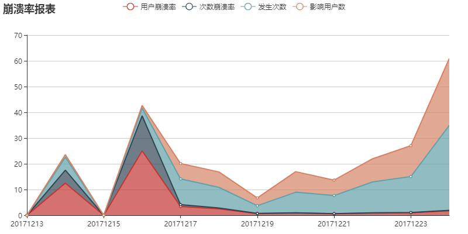
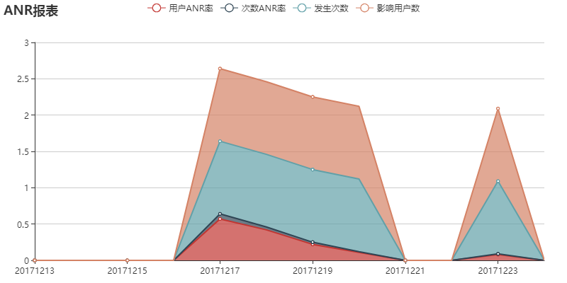

# spiderBugly

Bugly爬虫

# 使用步骤

1、安装package.json中引用的包，`npm install packageName --save` 或 `cnpm install packageName --save`命令

2、更改index.js文件中的Cookie和X-token的值

3、Sublime Text软件安装SublimeServer插件，Windows按Ctrl+Shift+P快捷键搜索SublimeServer

4、点击Tools菜单栏，启动SublimeServer，然后进入index.html文件，右击选择View in SublimeServer即可预览效果，会自动打开<http://localhost:8080/spiderBugly/index.html>

# FAQ

1、不能外部设置查询的开始和结束时间

2、不能外部设置Cookie和X-token的值

3、尚未部署到服务器中

# 展示效果

